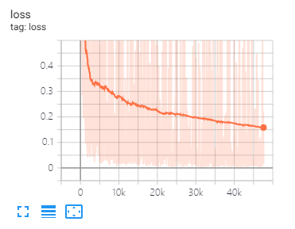

# fennlp

[](https://travis-ci.org/kyzhouhzau/fennlp/branches)
[](https://badge.fury.io/py/fenlp)
[](https://badge.fury.io/gh/kyzhouhzau%2Ffennlp)
[](https://codeclimate.com/github/kyzhouhzau/fennlp/maintainability)
[](https://github.com/kyzhouhzau/fennlp/blob/master/LICENSE)
[](https://coveralls.io/github/kyzhouhzau/fennlp)

# Package description
The field of natural language processing is currently undergoing tremendous changes, and many excellent models have been proposed in recent years, including BERT, GPT, etc.  
At the same time, graph neural network as an exquisite design is constantly being used in the field of natural language processing, such as TextGCN and Tensor-TextGCN.  
This toolbox is dedicated to natural language processing and expects to implement models in the simplest way.  
Keywords: NLP; GNN

Models:
* BERT
* ALBERT
* GPT2
* TextCNN
* Bilstm+Attention
* GCN, GAN 
* GIN, GraphSAGE
* TextGCN, TextSAGE

Examples (See tests for more details):

* BERT-NER (Chinese and English Version)
* BERT-CRF-NER (Chinese and English Version)
* BERT-CLS (Chinese and English Version)
* ALBERT-NER (Chinese and English Version)
* ALBERT-CLS (Chinese and English Version)
* GPT2-generation (English Version)
* Bilstm+Attention (Chinese and English Version)
* TextCNN(Chinese and English Version)
* GCN, GAN, GIN, GraphSAGE  (Base on message passing)
* TextGCN and TextSAGE for text classification


All the above experiments were tested on GTX 1080 GPU with memory 8000MiB.

# Status
2020/5/17: try to convert sentence to graph based on bert attention matrix, but failed.
This section provides a solution to visualize the BERT attention matrix.
For more detail, you can check dictionary "BERT-GCN". 

2020/5/11: add TextGCN and TextSAGE for text classification.

2020/5/5: add GIN, GraphSAGE for graph classfication.

2020/4/25: add GAN, GIN model, based on message passing methods.

2020/4/23: add GCN model, based on message passing methods.

2020/4/16：currently focusing on models of GNN in nlp, and trying to integrate some GNN models into fennlp.

2020/4/2: add GPT2 model, could used parameters released by OpenAI (base,medium,large). 
More detail reference dictionary "TG/EN/interactive.py"

2020/3/26: add Bilstm+Attention example for classification

2020/3/23: add RAdam optimizer.

2020/3/19: add test example "albert_ner_train.py" "albert_ner_test.py"

2020/3/16: add model for training sub word embedding based on bpe methods.
The trained embedding is used in TextCNN model for improve it's improvement.
See "tran_bpe_embeding.py" for more details.

2020/3/8: add test example "run_tucker.py" for train TuckER on WN18.

2020/3/3: add test example "tran_text_cnn.py" for train TextCNN model. 

2020/3/2: add test example "train_bert_classification.py" for text classification based on bert.

# Requirement
* tensorflow-gpu>=2.0
* typeguard
* gensim
* tqdm
* sentencepiece

# Usage

1. clone source
```
git clone https://github.com/kyzhouhzau/fennlp.git
```
2. install package
```
python setup.py install 
```
or 
```
pip install fennlp
```

3. run model
```
python bert_ner_train.py
```

# For NER：

## Input
* put train, valid and test file in "Input" dictionary.
* data format: reference data in  "tests\NER\Input\train"

    e.g. "拮 抗 RANKL 对 破 骨 细 胞 的 作 用 。	O O O O B-Anatomy I-Anatomy I-Anatomy E-Anatomy O O O O"
    
    For each line in train contains two parts, the first part "拮 抗 RANKL 对 破 骨 细 胞 的 作 用 。" is a sentence.
    The second part "O O O O B-Anatomy I-Anatomy I-Anatomy E-Anatomy O O O O" is the tag for each word in the sentence.
    Both of them use '\t' to concatenate.

### 1、bert (base, large)

```python
from nlpgnn.models import bert
bert = bert.BERT()
```

```
python bert_ner_train.py
```

```
_________________________________________________________________
Layer (type)                 Output Shape              Param #   
=================================================================
bert (BERT)                  multiple                  101677056 
_________________________________________________________________
dense (Dense)                multiple                  35374     
=================================================================
Total params: 101,712,430
Trainable params: 101,712,430
Non-trainable params: 0
_________________________________________________________________
```

### 2、bert + crf
```python
from nlpgnn.models import bert
from nlpgnn.metrics.crf import CrfLogLikelihood
bert = bert.BERT()
crf = CrfLogLikelihood()
```

```
python bert_ner_crf_train.py
```
```
_________________________________________________________________
Layer (type)                 Output Shape              Param #   
=================================================================
bert (BERT)                  multiple                  101677056 
_________________________________________________________________
dense (Dense)                multiple                  35374     
_________________________________________________________________
crf (CrfLogLikelihood)       multiple                  2116      
=================================================================
Total params: 101,714,546
Trainable params: 101,714,546
Non-trainable params: 0
_________________________________________________________________
```

### 3、albert (base, large, xlage, xxlage)
```python
from nlpgnn.models import albert
bert = albert.ALBERT()
```

```
python albert_ner_train.py 
```
```
large
Model: "albert_ner"
_________________________________________________________________
Layer (type)                 Output Shape              Param #   
=================================================================
albert (ALBERT)              multiple                  11092992  
_________________________________________________________________
dense (Dense)                multiple                  6921      
=================================================================
Total params: 11,099,913
Trainable params: 11,099,913
Non-trainable params: 0
_________________________________________________________________

```

Using the default parameters, we get the following results on "中文糖尿病标注数据集" and "CoNLL-2003" valid data.


|model    | macro-F1| macro-P| macro-R|  lr    |epoch   |maxlen  |batch_size| data|
| ------- |  -------| -------| -------| ------- |------- |------- |------- |-------|
|   bert+base  | 0.7005 | 0.7244 | 0.7031 | 2e-5  |3      |   128  |  6 |中文糖尿病标注数据集|
| bert+base+crf| 0.7009 | 0.7237 | 0.7041 | 2e-5(bert),2e-3(crf)|3 |    128   |  6 |中文糖尿病标注数据集|
|   bert+base  | 0.9128  | 0.9208 | 0.9227 | 2e-5 |5      |   128  |  8 |  CoNLL-2003    |
|  albert+base | 0.8512  | 0.8678 | 0.8589 | 1e-4 |8      |   128  |  16|  CoNLL-2003    |
|  albert+large| 0.8670  | 0.8778 | 0.8731 | 2e-5 |10     |   128  |  4 |  CoNLL-2003    |

# For Sentence Classfication
                 
## Input
* put train, valid and test file in "Input" dictionary.
* data format: reference data in "\tests\CLS\BERT( or ALBERT)\Input".

    e.g. "作 为 地 球 上 曾 经 最 强 的 拳 王 之 一 ， 小 克 里 琴 科 谈 自 己 是 否 会 复 出    2"
    
    For each line in train(test,valid) contains two parts, the first part "作 为 地 球 上 曾 经 最 强 的 拳 王 之 一 ，
    小 克 里 琴 科 谈 自 己 是 否 会 复 出" is the sentence, and second part "2" is the label.

### 1、bert (base, large)

```python
from nlpgnn.models import bert
bert = bert.BERT()
```

``` 
python train_bert_classification.py
```
```
_________________________________________________________________
Layer (type)                 Output Shape              Param #   
=================================================================
bert (BERT)                  multiple                  102267648 
_________________________________________________________________
dense (Dense)                multiple                  11535     
=================================================================
Total params: 102,279,183
Trainable params: 102,279,183
Non-trainable params: 0
_________________________________________________________________

```


### 2、TextCNN

```python
from nlpgnn.models import TextCNN
model = TextCNN.TextCNN()
```

``` 
python train_text_cnn.py
```

```
Use "WordPiece embedding" to Initialize word embedding. Train your embeddings.
python train_bpe_embedding.py
```
For more detail reference [WordPiece](https://mp.weixin.qq.com/s/Y6mCTqlf1yaTu99iKl-82Q) 


Using the default parameters, we get the following results on "新闻标题短文本分类"  and SST-2 valid data.

|model    | ACC     |  lr    |epoch   |maxlen  |batch_size|data|
| ------- | ------- |------- |------- |------- |-------   |-------   |
|bert+base|0.8899   |1e-5     |    5   |  50    |    32    |新闻标题短文本分类|
|bert+base| 0.9266|2e-5  |  3     | 128    |  8    |SST-2|
|albert+base| 0.9186|1e-5  |  3     | 128    |  16    |SST-2|
|albert+large| 0.9461|1e-6  |  3     | 128    |  4    |SST-2|
|Bilstm+attention| 0.8269|0.01  |  3     | 128    |  64    |SST-2|
|TextCNN| 0.8233|0.01  |  3     | 128    |  64    |SST-2|

# For Text Generation
### 1、GPT2 

```python
from nlpgnn.models import gpt2
bert = gpt2.GPT2()
```

``` 
python interactive.py
```

```
Model: "gen_gp_t2" base
_________________________________________________________________
Layer (type)                 Output Shape              Param #   
=================================================================
gpt2 (GPT2)                  multiple                  124439808 
=================================================================
Total params: 124,439,808
Trainable params: 124,439,808
Non-trainable params: 0
_________________________________________________________________
```

Example:
```
Input >>> Stocks continue to fall this week

Output >>> as stocks fall for the second consecutive week as investors flee for safe havens.

"The market is off the charts," said John Schmieding, senior vice president, market strategy at RBC Capital Markets. 
"We don't know what the Fed's intent is on, what direction it's going in. We don't know where they plan to go. 
We don't know what direction they're going to move into."

```

# TensorBoard
tensorboard can help you visualize losses and evaluate indicators:

useage:
```
 tensorboard --port 6006 --logdir="./tensorboard"
```
 


# GNN
## 1、GCN, GAN, GIN, GraphSAGE (Based on message passing)

Same data split and parameters setting as proposed in this [paper](https://arxiv.org/abs/1609.02907) 

* Nodes Classfication

|model    | Cora     |  Pubmed    |Citeseer  |
| ------- | -------  |-------     |-------   |
|GCN      |81.80   |79.50    |  71.20    |  
|GAN      |83.00   | 79.00   |  72.30    |

* Graph Classfication

|model    | MUTAG     |  PROTEINS    |NCI1  |
| ------- | -------  |-------     |-------   |
|GIN     |87.62±8.76<sup>#</sup>  | 73.05±1.85<sup>#</sup>  | 73.13±5.57<sup>#</sup>  |  
|GraphSAGE|86.06±8.26| 75.11±2.87 | 76.91±3.45 | 

Note: The # sign indicates that the current result is less than the paper result. 
In the paper the author use [this method to evaluate models](https://github.com/weihua916/powerful-gnns/issues/8).
This method is time expensive. So I did not do it like that here.

* Text Classfication

|model    | R8     |  R52    |
| ------- | -------  |------- |
|TextSAGE|  96.68±0.42 |92.80±0.32|
|TextGCN2019|  97.108±0.243 |  92.512±0.249 |

# Parameter Settings
1、For English tasks, you need to set the parameter "cased" (in fennlp.datas.checkpoint.LoadCheckpoint) to be consistent with your preprocessed input data to ensure that the tokenizer can correctly distinguish case.

2、When you use bert or albert, the following parameters is necessary:
```
param.maxlen
param.label_size
param.batch_size
```
if you don't know the count of label_size, the script will tell you when you first run the train codes.

3、Learning rate and batch_size will determine model convergence, see [Link](https://mp.weixin.qq.com/s/C-MMNaQdafK3JNh1ZGOVJA)  for more detail.

4、If you are not familiar with the optimizer in bert and albert, it does not matter.
The most important thing you need to remember is that the parameters "learning_rate" and "decay_steps" (in fennlp.optimizers.optim.AdamWarmup)
is important. You can set the "learning rate" to a relatively small value, and let "decay_steps" equal to samples*epoch/batch_size or little higher.

5、If you find that the code runs slower, you can try to use @ tf.function and set the appropriate model writing and evaluation frequency.

6、Any other problem you can concat me by "zhoukaiyinhzau@gmail.com" or ask questions in issue.   

# Reference

[1] [BERT: Pre-training of Deep Bidirectional Transformers for Language Understanding](https://arxiv.org/abs/1810.04805)  
[2] [ALBERT: A Lite BERT for Self-supervised Learning of Language Representations](https://arxiv.org/abs/1909.11942)  
[3] [Language Models are Unsupervised Multitask Learners](https://openai.com/blog/better-language-models/)  
[4] [Neural Message Passing for Quantum Chemistry](https://arxiv.org/pdf/1704.01212.pdf)  
[5] [Semi-Supervised Classification with Graph Convolutional Networks](https://arxiv.org/abs/1609.02907)  
[6] [Graph Attention Networks](https://arxiv.org/abs/1710.10903)  
[7] [How Powerful are Graph Neural Networks?](https://arxiv.org/abs/1810.00826)  
[8] [GraphSAGE: Inductive Representation Learning on Large Graphs](http://snap.stanford.edu/graphsage/)  
[9] [Diffusion Improves Graph Learning](https://arxiv.org/abs/1911.05485)  
[10] [Benchmarking Graph Neural Networks](https://arxiv.org/abs/2003.00982)  
[11] [Text Level Graph Neural Network for Text Classification](https://www.aclweb.org/anthology/D19-1345/)  
[12] [Graph Convolutional Networks for Text Classification](https://arxiv.org/abs/1809.05679)  
[13] [Tensor Graph Convolutional Networks for Text Classification](https://arxiv.org/abs/2001.05313)  
[14] [Deeper Insights into Graph Convolutional Networks for Semi-Supervised Learning](https://arxiv.org/pdf/1801.07606.pdf)
